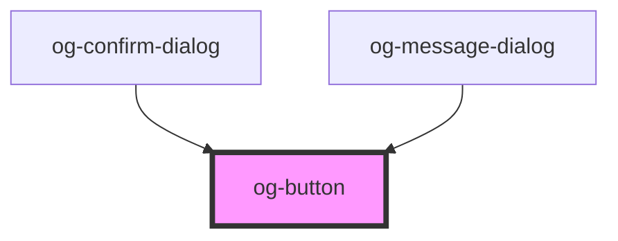

# og-button

<!-- Auto Generated Below -->

## Properties

| Property   | Attribute  | Description                                        | Type      | Default     |
| ---------- | ---------- | -------------------------------------------------- | --------- | ----------- |
| `blank`    | `blank`    | Sets the shape style for the Button to blank.      | `boolean` | `undefined` |
| `disabled` | `disabled` | Determines, whether the control is disabled or not | `boolean` | `undefined` |
| `flat`     | `flat`     | Sets the shadow level of the Button.               | `boolean` | `undefined` |
| `label`    | `label`    | The label of the button                            | `string`  | `undefined` |
| `outline`  | `outline`  | Sets the fill style for the Button to outline.     | `boolean` | `undefined` |
| `raised`   | `raised`   | Sets the shadow level of the Button.               | `boolean` | `undefined` |
| `round`    | `round`    | Sets the shape style for the Button to round.      | `boolean` | `undefined` |

## Events

| Event     | Description                                | Type               |
| --------- | ------------------------------------------ | ------------------ |
| `clicked` | Event is being emitted when value changes. | `CustomEvent<any>` |

## CSS Custom Properties

| Name                              | Description                                                                                                                                              |
| --------------------------------- | -------------------------------------------------------------------------------------------------------------------------------------------------------- |
| `--ob-button-Opacity`             | Opacity of the Button.                                                                                                                                   |
| `--ob-button-Opacity--disabled`   | Opacity of the button when it's disabled.                                                                                                                |
| `--og-button-Background`          | Main background color of the button                                                                                                                      |
| `--og-button-BorderColor`         | Main border color of the button                                                                                                                          |
| `--og-button-BorderRadius`        | Main border radius of the button                                                                                                                         |
| `--og-button-BorderStyle`         | Main border style of the button                                                                                                                          |
| `--og-button-BorderWidth`         | Main border Width of the button                                                                                                                          |
| `--og-button-BoxShadow`           | Initial BoxShadow of the button                                                                                                                          |
| `--og-button-BoxShadow--raised`   | BoxShadow of the button when it's raised                                                                                                                 |
| `--og-button-Color`               | Text color of the button label                                                                                                                           |
| `--og-button__text-Padding`       | Inner Space of the button label. Affects button measures.                                                                                                |
| `--og-button__text-TextTransform` | Text variant of the button label                                                                                                                         |
| `--og-color-main`                 | Main color of the background, used for the colored parts of the Button. E.g. used for Background in Solid Buttons, or Text and Overlay in Blank Buttons. |
| `--og-color-main--boost`          | Boost Color for Main Color to increase the contrast to text. E.g. used for Overlay on Solid Buttons.                                                     |
| `--og-color-main--conter`         | Conter Color to Main Color to guarantee good contrast. E.g. used for text on Main Color.                                                                 |
| `--og-color-main--disabled`       | Color variant for a disabled Button state. E.g. greys out all the colored parts.                                                                         |
| `--og-overlay-Background`         | Overlay Background used for :hover and :active state of the button.                                                                                      |
| `--og-overlay-BorderRadius`       | Overlay Border Radius. In order to obtain the same radius as the button.                                                                                 |
| `--og-overlay-Opacity`            | Inital Overlay opacity.                                                                                                                                  |
| `--og-overlay-Opacity--active`    | Overlay opacity on :active state of the button.                                                                                                          |
| `--og-overlay-Opacity--hover`     | Overlay opacity on :hover state of the button.                                                                                                           |

## Dependencies

### Used by

 - [og-confirm-dialog](../og-dialog/og-confirm-dialog)
 - [og-message-dialog](../og-dialog/og-message-dialog)

### Graph

----------------------------------------------

*Built with [StencilJS](https://stenciljs.com/)*
